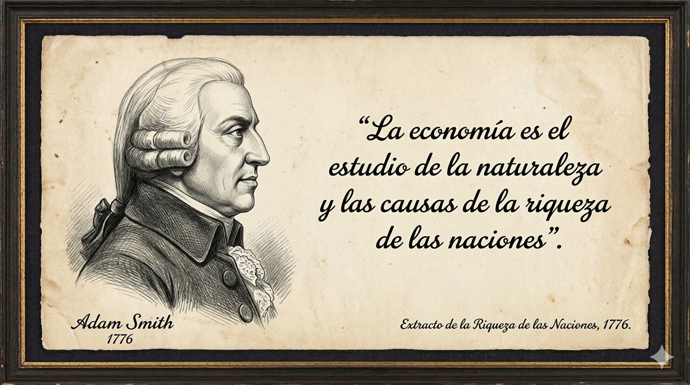
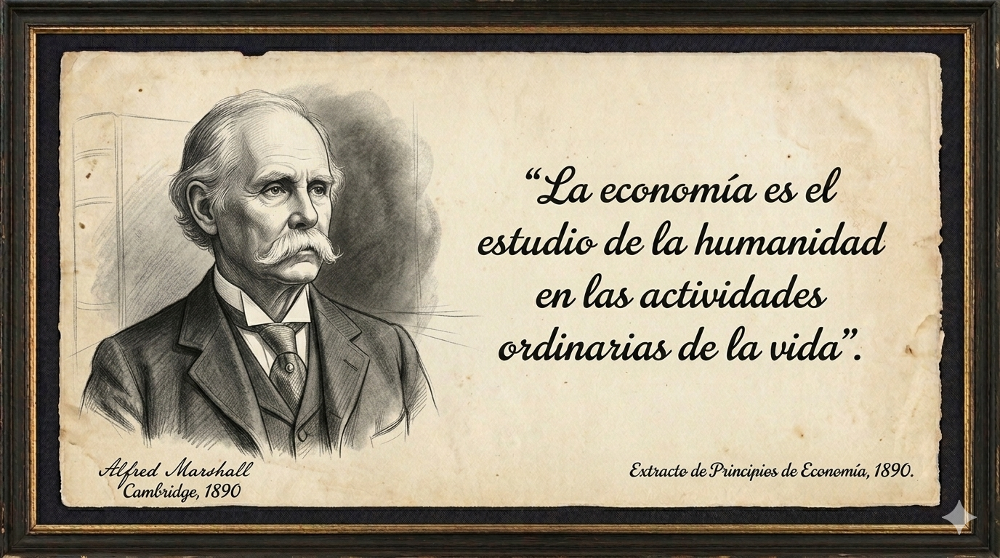
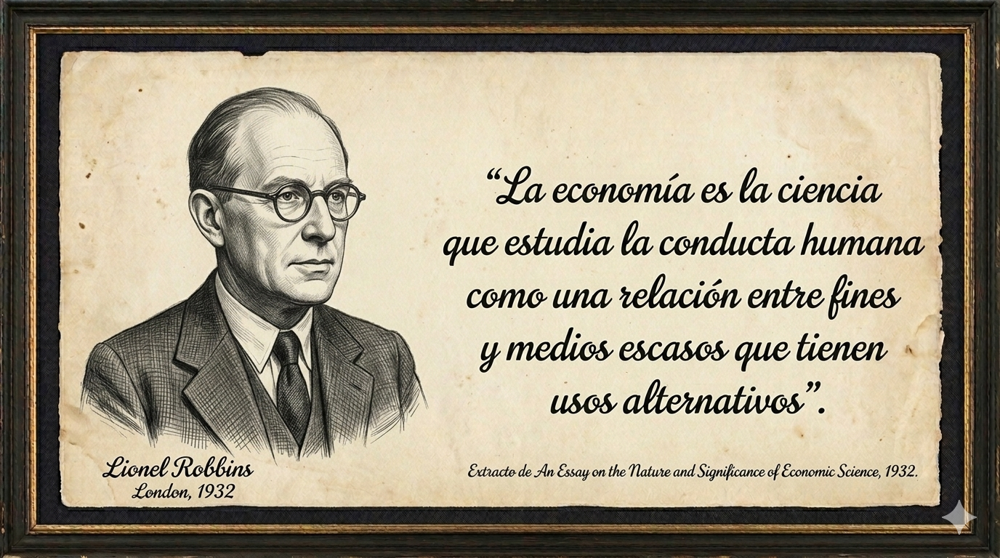
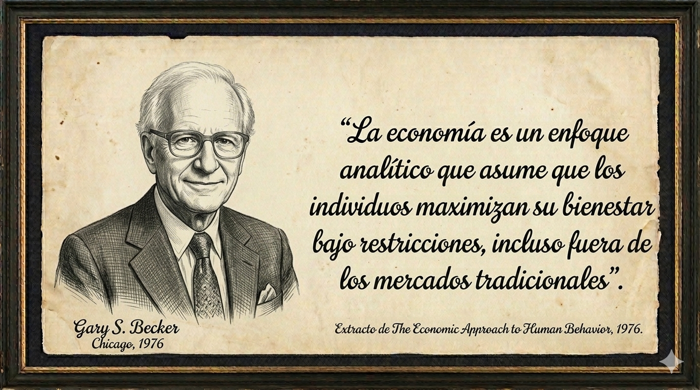
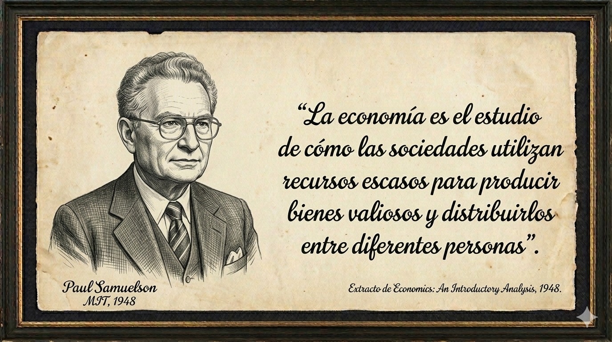
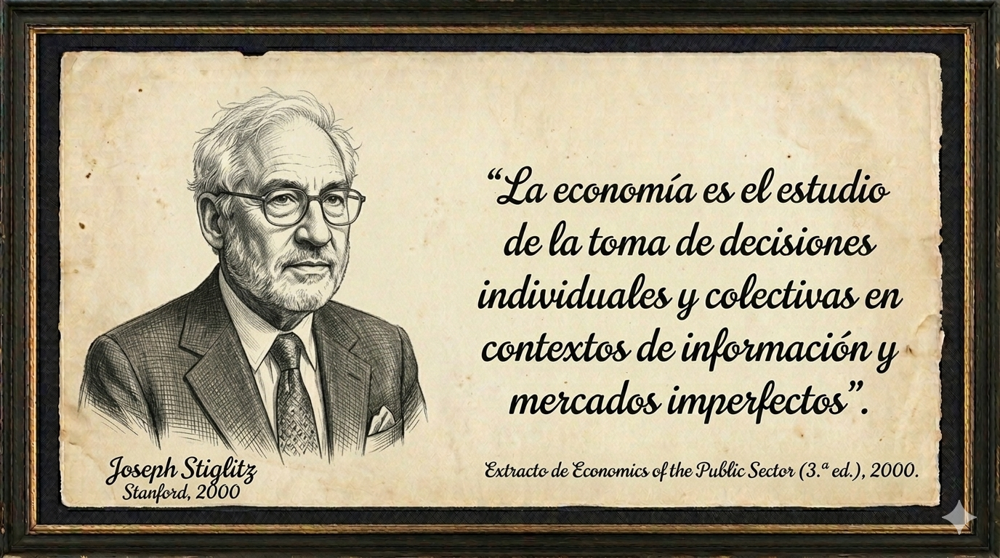
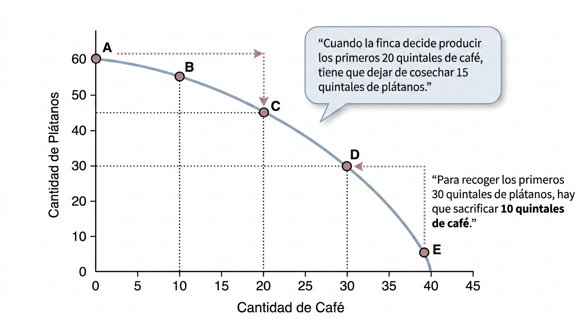
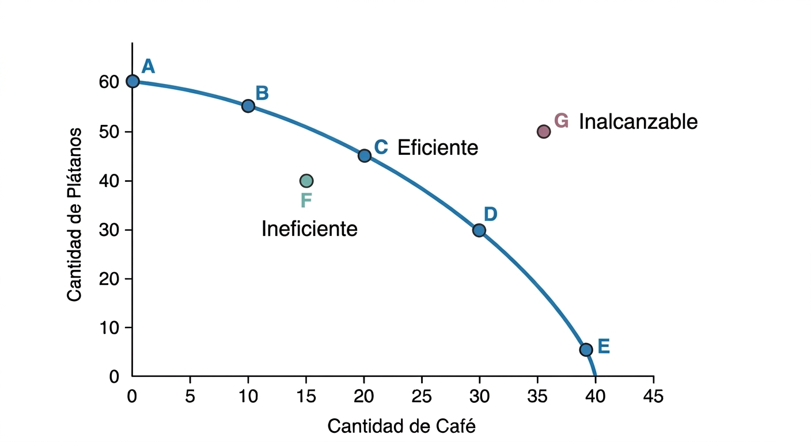
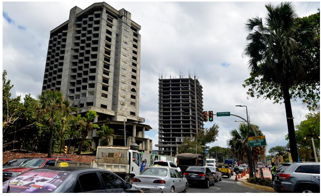

# Qué es la economía

## Objetivo del cápitulo

-   Mostrar la relevancia de la economía en la vida cotidiana, destacando cómo las decisiones personales, empresariales y gubernamentales en la República Dominicana están condicionadas por la escasez y los precios.

-   Definir qué estudia la economía como ciencia social, explicando su objeto de estudio: la asignación de recursos escasos para satisfacer necesidades ilimitadas.

-   Introducir los conceptos fundamentales del análisis económico, como escasez, elección, costo de oportunidad, eficiencia, incentivos y pensamiento marginal.

-   Explicar los principios básicos del comportamiento económico racional, incluyendo la optimización, la toma de decisiones marginales y los errores comunes como la falacia del costo hundido.

-   Presentar las principales áreas y enfoques de la economía, distinguiendo entre microeconomía y macroeconomía, así como entre el enfoque positivo y el normativo.

## Introducción

**“¡Es la Economía, estúpido!”**

Esta fue la famosa frase que fue clave para la inesperada victoria para el expresidente de los Estados Unidos Bill Clinton en las elecciones de 1992. Todas las predicciones apuntaban a una reelección de George H. W. Bush padre, cuya popularidad rondaba el 90% gracias a sus éxitos en materia de política exterior con el fin de la Guerra Fría y la guerra del Golfo. El enfoque estratégico de la campaña de Clinton se centró en cuestiones más relacionadas con la vida cotidiana de la ciudadanía y sus necesidades más inmediatas.

De la misma manera, la economía sigue teniendo una alta vinculación con nuestra cotidianidad a nivel personal o empresarial, ya que nos ayuda a comprender cómo las personas, las empresas y el Estado toman decisiones en un contexto de recursos limitados. Lejos de ser una disciplina abstracta o exclusivamente académica, la economía está presente en acciones tan simples como decidir qué comprar en el supermercado, aceptar un empleo, ahorrar parte del salario o evaluar si es conveniente endeudarse.

Cuando los dominicanos observan que los precios de los alimentos, el transporte o la electricidad suben, están experimentando los efectos de la inflación, una variable económica que impacta directamente el poder adquisitivo de sus salarios. Asimismo, la economía es clave para la toma de decisiones personales y familiares. En un país donde muchas familias dependen de remesas, créditos de consumo o préstamos hipotecarios, el conocimiento económico ayuda a comprender el costo real del endeudamiento, la importancia del ahorro y los riesgos asociados a las tasas de interés. La economía también es esencial para comprender cuando el gobierno anuncia inversiones en infraestructura o una reforma fiscal, se están tomando decisiones económicas que afectan a toda la sociedad.

En conclusión, el estudio de la economía no solo es importante para especialistas, sino para cualquier ciudadano que aspire a tomar decisiones informadas y a participar de manera consciente en la vida económica y social del país.

## ¿Qué estudia la economía?

La economía como área de estudio parte de una simple observación: los recursos disponibles (financieros, naturales, humanos, etc.) son limitados, pero los deseos de las personas (necesidades, aspiraciones, etc.) no lo son. Por ende, es necesario hacer el uso más eficiente posible de los recursos disponibles para satisfacer la mayor cantidad de necesidades de las personas. Como señalan Samuelson y Nordhaus (XXXX), la economía surge precisamente porque la sociedad no puede producir todo lo que las personas necesitan y desean al mismo tiempo. En este contexto la economía puede definirse como:

> **La ciencia social que estudia la manera en que los individuos, las empresas y los países deciden utilizar sus recursos escasos para satisfacer sus necesidades.**

### Escasez: el punto de partida

La escasez es uno de los conceptos centrales de la economía y constituye el punto de partida para comprender cómo funcionan las sociedades. En términos simples, la escasez se refiere a la situación en la que los recursos disponibles —como el tiempo, el dinero, la tierra, el trabajo o el capital— son limitados, mientras que las necesidades y deseos humanos son prácticamente ilimitados.

La escasez no es pobreza, ya que incluso los países, empresas y personas son impactados por ella. La escasez significa que solo existe una cantidad finita y limitada de recursos disponibles. Debido a esta realidad, no es posible producir todo lo que las personas quieren en las cantidades que desean, lo que obliga a tomar decisiones y a establecer prioridades.

La escasez también explica por qué los precios existen y cumplen un rol tan importante. En una economía, los precios actúan como señales que reflejan la escasez relativa de los bienes y servicios. Cuando un producto es escaso en relación con la demanda, su precio tiende a subir, incentivando a los productores a ofrecer más y a los consumidores a usarlo con mayor cuidado. De esta forma, la escasez contribuye a la asignación eficiente de los recursos. Comprender la realidad de la escasezpermite analizar estas decisiones de manera más realista y ya que todas las soluciones implican costos.

Por ejemplo, el gobierno dominicano enfrenta demandas crecientes de gasto en educación, salud, seguridad e infraestructura, pero dispone de ingresos limitados provenientes de impuestos y endeudamiento. Esta restricción obliga a priorizar: invertir más en transporte público puede significar menos recursos para otros programas sociales.

Asimismo, aunque la economía dominicana ha crecido en las últimas décadas, los empleos bien remunerados y con protección social siguen siendo limitados en relación con la oferta de trabajadores. Esto explica la persistencia de la informalidad laboral y las diferencias salariales entre sectores como turismo, zonas francas y comercio informal.

En conclusión, la escasez es una realidad estructural que condiciona las decisiones de individuos, empresas y del Estado en la República Dominicana. Entender su papel permite analizar mejor los problemas económicos del país y tomar decisiones más informadas tanto a nivel personal como colectivo.

### Necesidades: el objetivo final

Las necesidades pueden ser definidas son aquellos bienes y servicios indispensables para la supervivencia y el bienestar básico de las personas, como la alimentación, la vivienda, la salud y la educación. Los deseos, en cambio, representan aspiraciones o preferencias que van más allá de lo esencial y que están influenciadas por la cultura, el ingreso, la publicidad y el entorno social.

Adam Smith, considerado el padre de la Economía, ya observaba en su libro “La Riqueza de las Naciones” que lo que una sociedad considera “necesario” cambia con el tiempo y el contexto social. En economías modernas, bienes que antes eran considerados lujos —como el acceso a internet o un celular— se han convertido en necesidades prácticas para participar en el mercado laboral y en la vida social. Esto demuestra que las necesidades y deseos son dinámicos y tienden a expandirse con el crecimiento del ingreso y el desarrollo económico.

En la República Dominicana, muchas familias utilizan prácticamente todo su ingreso mensual para cubrir necesidades básicas como alimentos, transporte y electricidad. Sin embargo, a medida que el ingreso aumenta, surgen deseos adicionales, como adquirir un vehículo, mudarse a un lugar más espacioso o irse de vacaciones fuera del país.

### Elección: el proceso de tomar decisiones

En economía, la combinación de recursos escasos y deseos ilimitados es la base del problema fundamental de la elección. Dado que las personas, las empresas y los gobiernos no disponen de recursos suficientes para satisfacer todos sus deseos al mismo tiempo, se ven obligados a elegirentre alternativas. Estas elecciones no son aleatorias, sino que responden a un proceso racional orientado a obtener el mayor beneficio posible dadas las restricciones existentes. A este proceso se le conoce en economía como optimización.

La optimización consiste en seleccionar la mejor opción posible de entre un conjunto de alternativas, considerando una restricción presupuestaria, de tiempo o de recursos productivos. Por ejemplo, un consumidor quisiera consumir una amplia variedad de bienes, pero su ingreso es limitado. Frente a esta restricción, debe decidir cómo asignar su presupuesto para maximizar su satisfacción.

Este mismo razonamiento se aplica a las empresas. Toda compañía se crea con el objetivo de generar beneficios. Sin embargo, enfrentan las limitaciones de los recursos necesarios para producir. Por ende, deben elegir comprar la combinación óptima de materia prima que minimiza costos o maximiza producción. Así, la escasez obliga a las empresas a optimizar sus decisiones productivas y de inversión.

En el ámbito del sector público, la elección también está también condicionada por la escasez. Los gobiernos enfrentan grandes demandas sociales (mejor educación, salud, seguridad e infraestructura) pero cuentan con recursos fiscales limitados. La optimización se traduce entonces en asignar el presupuesto público de manera que maximice el bienestar social, sujeto a restricciones fiscales y políticas.

En conclusión, la coexistencia de recursos escasos y deseos ilimitados hace inevitable la elección económica. La optimización proporciona el marco analítico para entender cómo los agentes toman decisiones racionales, comparan alternativas y asignan recursos de la forma más eficiente posible dentro de sus limitaciones.

### La economía como ciencia: Definiciones clásicas y modernas

La economía es una ciencia social cuyo campo de estudio ha evolucionado a lo largo del tiempo, reflejando los cambios en las sociedades, los mercados y los problemas que enfrentan las personas, las empresas y los países.

A continuación, se presentan varias definiciones de economía formuladas por algunos de los economistas más influyentes. En conjunto, estas definiciones muestran que la economía no es un campo de estudio estático y limitado, sino una disciplina dinámica, que incorpora nuevas herramientas y amplia su radio de acción y su enfoque.

::: {.aforismos .column-page layout-ncol=2}

::: {}

:::
::: {}

:::
::: {}

:::
::: {}

:::
::: {}

:::
::: {}

:::

:::

::: {.callout-note appearance="simple"}
## ¿Es la economía una ciencia?

La economía se considera una ciencia, pero es una ciencia social, no una ciencia exacta como la física, la matemática o la química. La economía combina métodos científicos (datos, modelos, hipótesis) con el arte (juicio, política) debido a la complejidad del comportamiento humano, por lo que se centra más en mejorar la comprensión que en la predicción exacta. Los propios economistas tienen opiniones diversas, algunos enfatizan su rigor científico a través de pruebas empíricas y otros señalan sus limitaciones, distinguiéndola de las ciencias naturales, donde los experimentos controlados son más fáciles. Por ejemplo, los avances en el big data, la tecnología y la inteligencia artificial permiten un análisis más sofisticado de sistemas complejos.

Sin embargo, a algunos críticos les preocupa que calificarla de ciencia dura fomente el exceso de confianza y el dogmatismo, careciendo de una verdadera apertura científica a métodos diversos. De hecho, varias personalidades y grupos han pedido la abolición del Premio Nobel de Economía, entre ellos el premio Nobel Gunnar Myrdal, el exministro de Finanzas sueco Kjell-Olof Feldt y académicos como Bo Rothstein, que argumentan que otorga una autoridad indebida a las “ciencias blandas”, promueve ideologías específicas (a menudo de derecha), y crea un “aura de certeza” en un campo cargado de valores, lo que entra en conflicto con la verdadera intención de Nobel.

[*Sherpa, D., (2024). “The Nobel Illusion: Why the Nobel Prize in Economics Needs to be Abolished. October 22. Developing Economics*](https://developingeconomics.org/2024/10/22/the-nobel-illusion-why-the-nobel-prize-in-economics-needs-to-be-abolished/)

[*PBS News (2009). Samuelson on Whether Economics Is a Science. December 24.*](https://www.pbs.org/newshour/economy/samuelson-on-whether-economics)
:::

::: {.callout-note appearance="simple"}
## ¿Qué hacen los economistas?

Como dijo una vez el educador canadiense Laurence Peter: *“Un economista es un experto que mañana sabrá por qué las cosas que predijo ayer no sucedieron hoy”*.

Hablando más en serio, los economistas desempeñan múltiples funciones en la sociedad, y en la República Dominicana su trabajo es clave para el diseño de políticas públicas, el funcionamiento del sector privado y la comprensión de los problemas sociales y económicos del país.

En el sector público, los economistas cumplen un rol central como asesores de política económica. Trabajan en instituciones como el Banco Central, el Ministerio de Hacienda, la Superintendencia de Banco, el Banco de Reservas, la Dirección General de Impuestos Internos (DGII) y la Dirección General de Aduanas (DGA) donde participan en la formulación de políticas fiscales, monetarias, tributarias y de desarrollo. Sus análisis ayudan a decidir cómo asignar los recursos públicos, cómo responder a choques externos y cómo promover la estabilidad macroeconómica en una economía pequeña y abierta como la dominicana.

En el sector privado, los economistas apoyan la toma de decisiones empresariales mediante estudios de mercado, análisis de costos, proyecciones de demanda y evaluación de inversiones. También participan en el sistema financiero, evaluando riesgos, diseñando productos y analizando el comportamiento de los mercados.

Algunos economistas trabajan en el extranjero para empresas con importantes operaciones internacionales y para organizaciones internacionales como el Banco Mundial, el Fondo Monetario Internacional y las Naciones Unidas. Además, muchos economistas dominicanos se desempeñan como investigadores y académicos, generando conocimiento sobre temas como informalidad laboral, desigualdad regional, productividad o desarrollo sostenible. Finalmente, otros cumplen un rol educativo y comunicador, explicando fenómenos económicos al público, contribuyendo al debate nacional y fortaleciendo la cultura económica del país.
:::

## Principios del análisis económico

### Las personas enfrentan disyuntivas

Las disyuntivas (trade-offs) son conceptos fundamentales en economía por su rol en el estudio de cómo los individuos, las empresas y las sociedades toman decisiones para satisfacer necesidades con recursos limitados. Una disyuntiva se refiere a una situación en la que es necesario decidir renunciar o sacrificar una cosa para conseguir otra. Cuando no se puede tener todo a la vez, se enfrenta una disyuntiva.

Por ejemplo, pensemos en elegir qué comer: cocinar en casa suele suponer un ahorro, pero requiere más tiempo. Por el contrario, pedir comida para llevar ahorra tiempo, pero cuesta más dinero. Tomar este tipo de decisiones implica sopesar los beneficios y los costos de las distintas opciones, lo que inevitablemente requiere afrontar disyuntivas y, en última instancia, identificar la mejor alternativa.

El economista y comentarista político estadounidense Thomas Sowell (2002, 2013) dijo: “No hay soluciones a los problemas económicos, solo hay disyuntivas”.

Las disyuntivas en economía están en todas partes, incluidas las elecciones que hacen los consumidores al comprar bienes y servicios, las decisiones que toman las empresas al invertir en nuevas oportunidades o elaborar planes estratégicos. Los gobiernos también enfrentan disyuntivas. Por ejemplo, cuando el gobierno dominicano decidió designar el 4% del PIB a la educación, tiene que sacrificar la inversión en otras áreas que podría haber hecho con ese dinero, como gastarlo en la defensa nacional, construir carreteras o pagar la deuda pública.

### Toda decisión tiene un costo de oportunidad

El costo de oportunidad es uno de los conceptos más importantes de la economía. Se define como el valor de la mejor alternativa a la que se renuncia cuando se toma una decisión. En otras palabras, cada vez que elegimos algo, estamos dejando de lado otra opción. Por consiguiente, el verdadero costo no es solo el dinero que gastamos, sino lo que sacrificamos para tomar la decisión.

Este concepto es clave porque los recursos —como el tiempo, el dinero y el trabajo— son limitados. Por eso, personas, empresas y gobiernos deben pensar no solo en lo que obtienen con una decisión, sino también en lo que dejan de ganar.

Por ejemplo, imaginemos que en la República Dominicana un joven con educación secundaria puede ganar en promedio alrededor de RD\$15,000 mensuales, mientras que uno con educación universitaria puede ganar cerca de RD\$35,000 mensuales. Si el joven decide trabajar inmediatamente después del bachillerato y no ir a la universidad, su costo de oportunidad es el mayor salario futuro que podría haber obtenido con estudios universitarios, es decir RD\$ 35,000 mensuales. Aunque gana hoy estaría ganando RD\$15,000 mensuales, con dejar la universidad estaría renunciando a mejores ingresos en el futuro.

Para ilustrar el impacto del concepto de costo de oportunidad, utilizaremos un instrumento grafico llamado la frontera de posibilidades de producción (FPP). La FPP muestra las combinaciones máximas de dos bienes que una economía puede producir cuando utiliza plenamente sus recursos y tecnología. La relación con el costo de oportunidad es directa: cada punto de la FPP refleja cuánto de un bien debe sacrificarse para obtener más del otro.

Cuando una economía se mueve a lo largo de la FPP, aumentar la producción de un bien implica renunciar a parte de la producción del otro. Esa cantidad sacrificada es precisamente el costo de oportunidad. Por ejemplo, si para producir más alimentos se reduce la producción de ropa, la ropa dejada de producir representa el costo de oportunidad de producir más alimentos.

Además, la forma típica cóncava de la FPP ilustra el costo de oportunidad creciente: a medida que se produce más de un bien, se deben sacrificar cantidades cada vez mayores del otro, porque los recursos no son igualmente eficientes en todas las actividades. Así, la FPP permite visualizar de manera clara y concreta el concepto de costo de oportunidad en una economía.

La FPP representa la necesidad de elegir entre los 2 bienes. Producir más de un bien supone producir menos de otro. La razón es que como todos los factores están siendo utilizados, si queremos producir más peces tendremos que usar parte de los trabajadores y otros recursos que usábamos para recolectar vegetales, y por tanto obtendremos menos cantidad. El coste de oportunidad de producir más de un bien es renunciar a producir el otro.

Así, pasar de la combinación A a la combinación C nos permite producir 20kg de peces más, pero tendremos que renunciar a 15kg de vegetales. El coste de oportunidad de 20kg de peces es renunciar a 15kg de vegetales en ese punto de la frontera. De la misma manera, pasar de la combinación E a la combinación D nos permite producir 30kg de vegetales más, pero tenemos que renunciar a 10kg de peces. [El coste de oportunidad de 30kg de peces es renunciar a 10 de vegetales en ese punto de la frontera]{.underline}.

La frontera de posibilidades también nos permite entender el concepto de eficiencia que hemos visto en este tema. A un país le ocurre lo mismo lo que a mi alumna María, tiene una serie de recursos como trabajadores, máquinas y recursos naturales, y puede emplearlos de manera más o menos eficiente.

La FPP nos muestra LAS COMBINACIONES EFICIENTES de la aldea. Es decir, todos los puntos de la curva de FPP son eficientes (utilizamos todos los recursos disponibles de la mejor forma posible), con nuestra tecnología y nuestros factores productivos, estamos produciendo lo máximo posible.

Cuando los habitantes de la aldea pescan 20 kg de peces y recolectan 45kg de vegetales están siendo eficientes porque no pueden conseguir una combinación igual o mejor en ambos bienes (no se puede pescar 30 kg y recolectar 50kg por ejemplo).

De esta manera la FPP nos permite separar dos regiones.

- [Puntos ineficientes.]{.underline} Aquellos puntos que se encuentran por debajo de la curva, representan combinaciones ineficientes pues se están despilfarrando recursos (como cuando María memorizaba y perdía dos horas de estudio). Es decir, o bien no estamos usando recursos o bien los usamos de manera incorrecta (como María cuando elegía una mala técnica de estudio). Si en nuestra aldea se pescaran 20 peces y se recolectaran 20 vegetales (combinación F) se estaría siendo ineficiente, ya que si usamos todos los recursos que tenemos podríamos pescar 20 peces y recolectar 45 vegetales (combinación C). La combinación 20 peces y 20 vegetales es por tanto ineficiente y se representa en el punto F por debajo de la curva.

- [Puntos inalcanzables.]{.underline} Aquellos puntos que se encuentra por encima de la curva son posiciones inalcanzables con los factores productivos y la tecnología disponible en ese momento dado. En nuestra aldea no podemos pescar 30 peces y recolectar 40 vegetales (punto G). Esa combinación es inalcanzable con los recursos y tecnología que tenemos. Sin embargo, con el paso del tiempo, las posiciones inalcanzables se pueden llegar a alcanzar si suceden una serie de circunstancias. Es lo que llamamos crecimiento económico.

### La persona racional piensa en términos marginales

La racionalidad en economía es la idea de que los agentes (individuos, empresas, gobierno) toman decisiones lógicas para maximizar su bienestar (utilidad, beneficios) evaluando costos y beneficios, eligiendo la mejor opción disponible. Sin embargo, el desarrollo reciente de la economía conductual liderada por el profesor Richard Thaler, premio nobel en economía 2017, ha demostrado que las decisiones reales son limitadas por información imperfecta y los sesgos psicológicos, limitando el ejercicio de la racionalidad a buscar una solución lo “suficientemente buena”, en lugar de la perfecta. Sobre esto profundizaremos más adelante.

En economía, pensar en términos marginales significa tomar decisiones comparando los beneficios y costos adicionales de tomar una determinada decisión en lugar de evaluar los beneficios y costos totales. Este enfoque reconoce que la mayoría de las decisiones económicas no son de “todo o nada”, sino incrementales: producir una unidad más, trabajar una hora adicional o gastar un peso extra. Un principio central de la economía establece que una acción debe realizarse si su beneficio marginal es mayor o igual a su costo marginal.

Pensar en el margen es fundamental para entender el comportamiento racional de individuos, empresas y gobiernos. Por ejemplo, una persona no decide si trabajar o no únicamente en función de su salario total mensual, sino considerando si el ingreso adicional por una hora extra de trabajocompensa el cansancio, el tiempo libre perdido o el costo del transporte. Este razonamiento marginal permite explicar por qué las decisiones cambian cuando cambian los incentivos, aun cuando los niveles totales permanezcan constantes.

En la República Dominicana, un primer ejemplo se observa en las empresas turísticas, como hoteles y restaurantes. Un hotel decide si aceptar una reserva adicional evaluando si el ingreso marginal de ocupar una habitación más supera el costo marginal de limpieza, energía y personal. Incluso si el hotel ya cubrió sus costos fijos, la decisión de vender una habitación extra a un precio reducido puede ser rentable si el beneficio marginal es positivo.

::: {.callout-note appearance="simple"}

## La falacia del costo hundido

En economía, un costo hundido es un costo que ya se ha incurrido y que no puede recuperarse, independientemente de las decisiones que se tomen en el futuro. Debido a esta característica, los costos hundidos no deberían influir en las decisiones económicas racionales, ya que solo los costos y beneficios futuros son relevantes para elegir entre alternativas. Sin embargo, en la práctica, personas y organizaciones suelen cometer el error de considerar estos costos pasados, lo que conduce a decisiones ineficientes.

La falacia del costo hundido es un error común que se comente cuando se sigue invirtiendo en un proyecto o decisión que no es rentable, simplemente porque ya se ha gastado mucho tiempo, dinero o esfuerzo en él, en lugar de evaluar si continuar es la mejor opción. Es la tendencia a no querer "perder" lo invertido, incluso si la lógica indica que es mejor abandonar y minimizar pérdidas.

Un ejemplo de esta situación es el caso del Hotel “El Prado” en el Malecón de Santo Domingo, paralizado en los años noventa por un problema de caverna subterránea que requirió costosas inyecciones de hormigón, llevando a la quiebra del banco promotor. El proyecto, ubicado a pocos metros de la esquina de las avenidas 30 de mayo y Máximo Gómez, buscaba construir un hotel de 5 estrellas con 20 niveles y restaurante giratorio.

{.rounded}

El alto costo de esta reparación necesaria para terminar el proyecto fue el factor clave para su abandono definitivo. Este caso ilustra perfectamente como un problema técnico (la caverna) se transformó en un desastre financiero y legal, dejando un gran costo hundido. En este caso, la decisión de abandonar el proyecto se tomó demasiado tarde, dejando hoy una enorme estructura abandonada en medio del malecón de Santo Domingo.

:::

### Las personas responden a incentivos

Un incentivo es cualquier factor que motiva o desalienta una determinada decisión o comportamiento, ya sea de naturaleza económica, social o moral. Debido a que los individuos buscan mejorar su bienestar dadas sus restricciones, tienden a ajustar su comportamiento cuando cambian los costos y beneficios asociados a sus decisiones.

En economía, los incentivos suelen ser monetarios (como salarios, precios, impuestos o subsidios), pero también pueden ser no monetarios, como el prestigio, la seguridad, el tiempo libre o el cumplimiento de normas sociales. Este principio parte de la idea de que, al tomar decisiones, las personas comparan costos y beneficios y ajustan su comportamiento cuando estos cambian.

Las personas responden a incentivos comparando beneficios y costos marginales. Cuando el beneficio esperado de una acción aumenta o su costo disminuye, es más probable que esa acción se realice. Por el contrario, si una política encarece una conducta o reduce sus beneficios, las personas tienden a evitarla. Por ello, los economistas prestan especial atención a cómo las políticas públicas, las reglas del mercado o las condiciones económicas alteran los incentivos y, en consecuencia, los resultados económicos. Ignorar los incentivos puede llevar a políticas ineficientes o con efectos no deseados.

En la República Dominicana, si el gobierno reduce costos de registro y ofrece incentivos fiscales a las pequeñas y medianas empresas, más negocios podrían encontrar más atractivo operar en la formalidad. En cambio, altos impuestos o trámites complejos generan incentivos para permanecer en la informalidad. Algo similar sucede cuando el gobierno subsidia los precios de la gasolina o el gas licuado de petróleo (GLP), los consumidores tienden a usar más sus vehículos o a consumir más energía, porque el costo por unidad es menor. En cambio, cuando los precios suben, las personas buscan alternativas, como reducir viajes o usar transporte público. Estos casos muestran claramente cómo los incentivos influyen en las decisiones cotidianas.

## Las áreas de estudio de la economía

El estudio de la economía se divide tradicionalmente en dos grandes áreas: la microeconomía y la macroeconomía. Aunque analizan la realidad económica desde distintos niveles, ambas son complementarias y necesarias para comprender cómo funciona una economía en su conjunto.

### Microeconomía

La microeconomía se centra en el comportamiento de los agentes individuales (hogares, empresas y sectores de la economía) y en cómo toman decisiones. Por ejemplo, la microeconomía se aplica al estudio del comportamiento de los consumidores, como la forma en que los hogares dominicanos ajustan su consumo de alimentos, transporte o electricidad cuando cambian los precios o sus salarios. Este análisis permite comprender cómo se forman los precios y cómo reaccionan los agentes económicos ante distintos incentivos.

A nivel empresarial, la microeconomía nos ayuda a entender el impacto que tiene un cambio en el costo de las materias primas sobre el precio de venta al consumidor de cualquier bien o servicio. La microeconomía también nos ayuda a entender cómo el sector turístico se ajusta al impacto que tiene un aumento del precio de los pasajes aéreos sobre la llegada de visitantes al país o la proliferación del sargazo en las playas sobre los costos de operación de los hoteles.

### Macroeconomía

La macroeconomía, en cambio, estudia el comportamiento de la economía en su conjunto y se centra en el análisis de variables agregadas, como el producto interior bruto (PIB), la inflación, el desempleo y las políticas económicas que el gobierno implementa para influir en estos indicadores. A diferencia de la microeconomía, la macroeconomía se centra en el análisis de la economía desde una perspectiva global, examinando cómo interactúan todos los mercados en su conjunto y las relaciones entre países en lo que respecta al comercio y la inversión internacional. Este enfoque permite identificar patrones, ciclos económicos y tendencias que afectan a millones de personas y a la estabilidad de los sistemas económicos.

Los gobiernos utilizan el análisis macroeconómico para formular políticas fiscales (impuestos y gasto público) y monetarias (control de la oferta de dinero y las tasas de interés). Estas políticas tienen como objetivo estabilizar la economía, fomentar el crecimiento y reducir el desempleo. Las empresas también utilizan el análisis macroeconómico para planificar inversiones, fijar precios y determinar estrategias de mercado en función del entorno económico. Una economía estable es fundamental para el bienestar de la población. En concreto, la macroeconomía ayuda a identificar y mitigar los riesgos de crisis económicas, como las recesiones o la hiperinflación.

## Los enfoques de la economía

En economía, suelen distinguirse dos grandes enfoques para su estudio: el enfoque positivo y el enfoque normativo. Ambos son complementarios y permiten analizar la realidad económica desde perspectivas distintas, pero relacionadas.

El enfoque positivo se centra en describir y explicar cómo funciona la economía en la práctica, para lo que utiliza datos, modelos y evidencia empírica. Su objetivo es responder a preguntas del tipo «qué es» o «qué ocurre si», evitando juicios de valor.

En la República Dominicana, el enfoque positivo se puede ilustrar con el análisis del comportamiento de la inflación. Por ejemplo, un economista puede estudiar cómo los cambios en los precios internacionales del petróleo afectan a la inflación interna utilizando estadísticas del Banco Central. Los resultados obtenidos nos indicarían numéricamente la magnitud del cambio en la inflación cuando sube o baja el petróleo.

En contraste, el enfoque normativo se ocupa de evaluar los resultados económicos y de proponer cómo debería funcionar la economía según ciertos criterios de bienestar, equidad o justicia social, y responde a preguntas como «¿qué debería ser?».

Este enfoque se aplica cuando se discuten políticas públicas y objetivos sociales. Por ejemplo, si los sindicatos exigen a los empresarios un aumento de salarios, un análisis con un enfoque normativo se centraría en si el salario mínimo debería aumentarse para mejorar el nivel de vida de los trabajadores, aunque ello pudiera implicar un posible aumento del desempleo o de la inflación. En este caso, entran en juego juicios de valor sobre equidad y bienestar.

En conjunto, el enfoque positivo aporta pruebas y comprensión, mientras que el normativo orienta las decisiones de política económica. Ambos son esenciales para analizar y afrontar los desafíos económicos de la República Dominicana.

## Preguntas de repaso {.unnumbered}

1. ¿Por qué la escasez es el punto de partida del análisis económico?

1. ¿Cuál es la diferencia entre necesidades y deseos?

1. Explique con un ejemplo dominicano el concepto de disyuntiva.

1. ¿Qué es el costo de oportunidad y por qué es clave para tomar decisiones?

1. ¿Cómo la FPP ayuda a ilustrar el costo de oportunidad?

1. ¿Qué significa que una economía opere de manera eficiente?

1. ¿Por qué los costos hundidos no deberían influir en las decisiones racionales?

1. ¿Qué implica pensar en términos marginales?

1. ¿Cómo influyen los incentivos en el comportamiento de las personas y las empresas?

1. ¿En qué se diferencian la microeconomía y la macroeconomía, y por qué ambas son necesarias?

## Ejercicios {.unnumbered}

1. Identifique tres situaciones de escasez que sean importantes en el lugar donde vive (agua, mano de obra cualificada, electricidad, tierra, crédito). Explique cómo se refleja cada escasez en los precios o las colas, y proponga una política para reducirla. Utilice el coste de oportunidad para justificar su propuesta.

2. Una familia recibe RD$ 12,000 en remesas este mes. Enumere tres usos alternativos y analice el costo de oportunidad de cada uno. ¿Qué opción tiene el mayor rendimiento esperado y por qué?

3. El salario mínimo en la República Dominicana varía según el tamaño de la empresa. ¿Cómo reconoce este diseño institucional las escaseces heterogéneas entre las empresas? ¿En qué condiciones podría esta diferenciación ralentizar la formalización?

4. Dibuje una PPF para «servicios turísticos» frente a «manufactura». ¿Qué inversiones públicas desplazarían la FPP hacia afuera para ambos bienes simultáneamente? Defienda su respuesta con ejemplos dominicanos.

5. Suponga que las llegadas de visitantes crecen un 5 % el próximo año. Discuta los posibles cuellos de botella (agua, energía, transporte) y los costos de oportunidad de satisfacer ese aumento mediante (i) nueva capacidad frente a (ii) gestión de la demanda.

6. Describa algunas disyuntivas que enfrentan los siguientes actores:
    1. Una familia que está pensando en comprar un automóvil nuevo.
    2. Un miembro del Congreso que debe decidir cuánto gastar en parques acionales.
    3. El presidente de una empresa que debe decidir abrir o no una nueva 1ábrica.
    4. El profesor que decide por cuánto tiempo preparar su clase.
    5. Alguien recién egresado de la universidad que decide si cursar o no una maestría.
  
7. Usted está tratando de decidir si debe tomar o no vacaciones. La mayor parte del costo de las vacaciones, como el avión, el hotel y dejar de recibir un salario, se mide en términos monetarios, pero los beneficios de las vacaciones son psicológicos. ¿Cómo podemos comparar los beneficios y los costos?

8. Usted está planeando pasar el sábado trabajando en un empleo de medio tiempo, pero un amigo lo invita a esquiar. ¿Cuál es el verdadero costo de ir a esquiar? Ahora suponga que usted había planeado pasar el día estudiando en la biblioteca. En este caso ¿cuál es el costo de ir a esquiar? Explique.

9. Usted gana \$100 apostando a un equipo de basquetbol. Ahora debe decidir entre gastar ese dinero o depositarlo en el banco por un año y ganar 5% de interés. ¿Cuál es el costo de oportunidad de gastar los $100 ahora?

10. La empresa que usted dirige invierte \$5 millones para desarrollar un nuevo producto, pero su desarrollo no está totalmente terminado. En una junta el personal de ventas le informó que el lanzamiento de productos parecidos de los competidores probablemente reducirá las ventas del nuevo producto a $3 millones. Si cuesta un millón completar el desarrollo del producto y fabricarlo, ¿se debería seguir adelante con el proyecto? ¿Cuánto es lo más que se debe pagar para completarlo?

